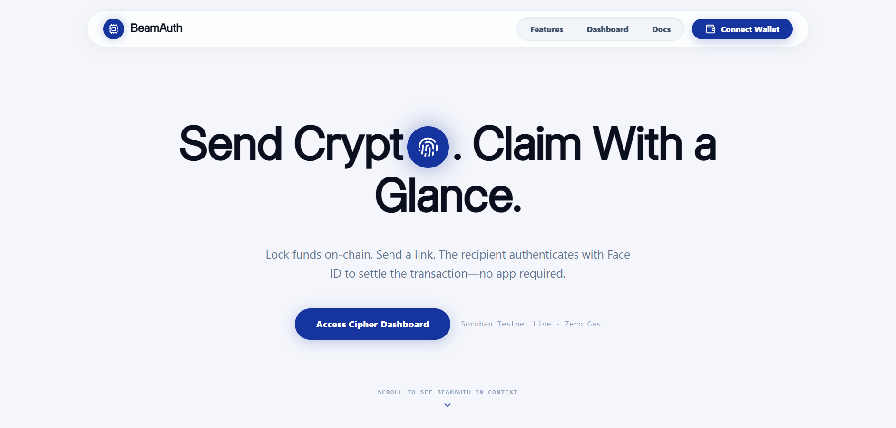
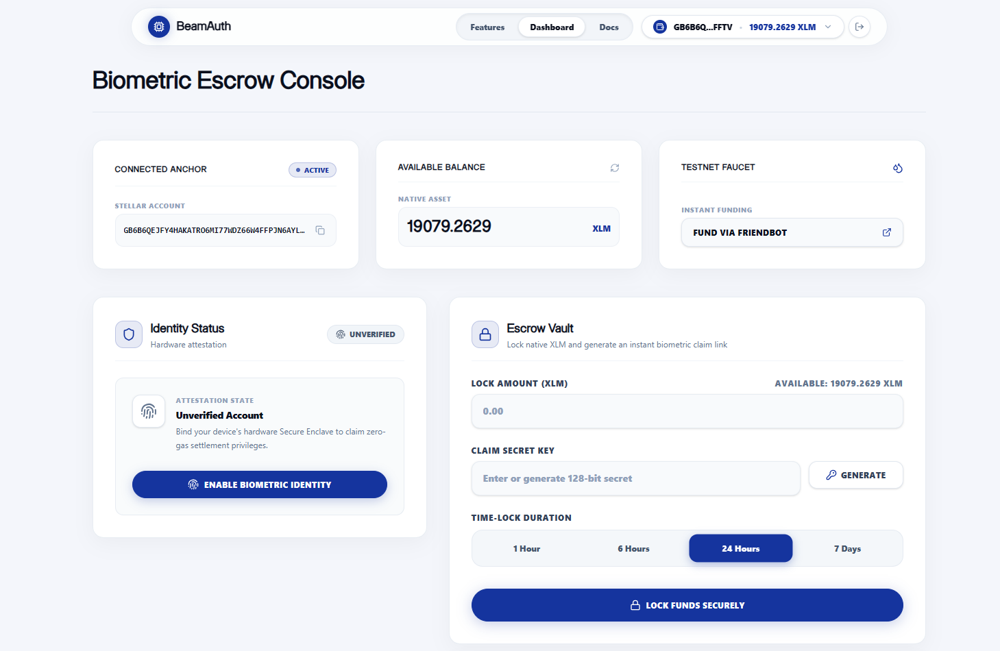
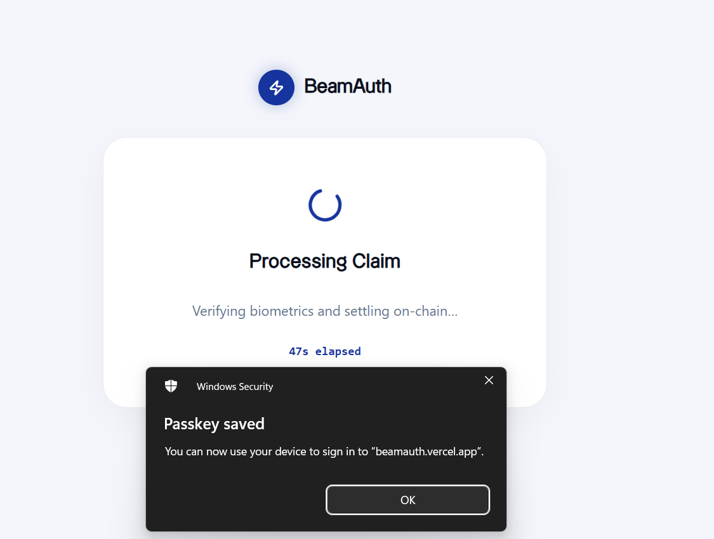

<h1 align="center">⚡ BeamAuth</h1>

<div align="center">
  
  
  
  
  <br />
  <a href="https://beamauth.vercel.app">
    
  </a>
  <a href="https://github.com/yashannadate/BeamAuth/actions">
    
  </a>
</div>

<br />

<div align="center">
  <strong>The Future of Passkey-Powered Web3 Onboarding on Stellar.</strong>
</div>

<p align="center">
  BeamAuth simplifies Web3 onboarding on Stellar Soroban by combining WebAuthn Passkeys (biometric authentication) with deterministic Smart Wallets and atomic escrow link claims. Users lock native XLM into verifiable on-chain escrows and send simple claim links—allowing recipients to deploy smart wallets and claim funds instantly using just FaceID or TouchID without seed phrases.
  <br />
  <br />
  <a href="https://beamauth.vercel.app"><strong>🔴 Launch Live Demo</strong></a> · <a href="https://github.com/yashannadate/BeamAuth"><strong>📁 Explore Repository</strong></a>
</p>

---

## 📸 Application Interface

| Landing Page | Dashboard & Escrow Lock |
| :---: | :---: |
|  |  |
| **Passkey Biometric Claim** | **Gasless Relayer Execution** |
|  |  |

---

## 🏗 Architecture & Call Flow

```text
┌─────────────────────────────────────────────────────────────────┐
│                     Next.js 15 Frontend                         │
│   (WalletContext • SimpleWebAuthn • Freighter API • Horizon)    │
└──────────────┬──────────────┬──────────────┬──────────────┬─────┘
               │              │              │              │
        Horizon REST     Horizon REST   Soroban RPC    Relay API
               │              │              │              │
  ┌────────────▼──────────────▼───┐  ┌───────▼──────────────▼──────┐
  │     Stellar Testnet Ledger    │  │       BeamAuth Relayer      │
  │      (Account & Balances)     │  │       (Gasless Fee-Bump)    │
  │                               │  │                             │
  │ lock_funds                    │  │ deploy_wallet (Factory)     │
  │ claim_funds ──────────────────┼──► XLM Transferred atomically  │
  │ reclaim_funds                 │  │                             │
  └───────────────────────────────┘  └─────────────────────────────┘
```

**Inter-Contract Data Flow:**
1. **Lock:** `Frontend` → `Freighter Wallet` → `Soroban RPC` → `lock_funds()` → Native XLM locked in Escrow vault under SHA-256(Secret).
2. **Claim:** `Recipient` → `TouchID/FaceID` → `WebAuthn Attestation` → `/api/relay` → Fee-Bump Transaction executed on-chain.
3. **Atomic Settlement:** Relayer invokes `deploy_wallet()` on Factory Contract → Invokes `claim_funds()` on Escrow Contract → XLM transferred cleanly to new Smart Wallet.

---

## ⚡ Core Features

- 🔐 **Biometric Passkey Authentication** — Onboard users seamlessly using Apple FaceID, TouchID, or Windows Hello. Zero seed phrases required.
- 🏭 **Deterministic Smart Wallets** — Custom account contracts (`__check_auth`) deployed on-demand derived from secp256r1 public keys.
- 🛡️ **Non-Custodial Escrow Vaults** — Funds locked on-chain with cryptographic SHA-256 hash pre-image verification and expiration guards.
- ⛽ **Gasless Fee Sponsorship** — Platform relayer wraps user claims in Fee-Bump transactions, allowing recipients to claim with 0 XLM balance.
- 📱 **Freighter Extension Integration** — Deep integration with `@stellar/freighter-api` with progressive state-driven error feedback.
- ⚡ **Real-Time Event Polling** — Frontend listens dynamically for Soroban `claimed` contract events to transition UI states instantly.

---

## 🚀 Deployed Contracts

| Contract | Contract ID / WASM Hash | Network |
|---|---|---|
| **Escrow Vault Contract** | [`CAH7SZBIBQPH7E57UOU5MFR6V2VQBROBTMVPJ2MOUCRP7H7NSRIFRDCV`](https://stellar.expert/explorer/testnet/contract/CAH7SZBIBQPH7E57UOU5MFR6V2VQBROBTMVPJ2MOUCRP7H7NSRIFRDCV) | Stellar Testnet |
| **Wallet Factory Contract** | [`CCDV672F6FHX4G7FUV7Z4CJNPVAMR445QO6BR2BDKS44YBQET6UJFAX3`](https://stellar.expert/explorer/testnet/contract/CCDV672F6FHX4G7FUV7Z4CJNPVAMR445QO6BR2BDKS44YBQET6UJFAX3) | Stellar Testnet |
| **Passkey Wallet WASM Hash** | `fd13e7137de16838fb5527bb031231be19b4f37464b55cc655111f4cf45ed8a5` | Uploaded Binary |
| **Native Asset Contract (XLM)** | [`CDLZFC3SYJYDZT7K67VZ75HPJVIEUVNIXF47ZG2FB2RMQQVU2HHGCYSC`](https://stellar.expert/explorer/testnet/contract/CDLZFC3SYJYDZT7K67VZ75HPJVIEUVNIXF47ZG2FB2RMQQVU2HHGCYSC) | Stellar Testnet |
| **Platform Relayer Account** | [`GCECDZC5EMFR6DIHRLQ6GAYGAIPDJSBAXDO27GUJHXZF6ZIQRF7ULDGD`](https://stellar.expert/explorer/testnet/account/GCECDZC5EMFR6DIHRLQ6GAYGAIPDJSBAXDO27GUJHXZF6ZIQRF7ULDGD) | Stellar Testnet |

---

## 📙 Level 3 — Orange Belt Features

| Feature | Status | Details |
|---------|--------|---------|
| 🔐 Passkey Onboarding | ✅ Live | WebAuthn secp256r1 signature verification on Soroban |
| ⛽ Gasless Relayer Execution | ✅ Live | Fee-Bump transaction sponsorship at `/api/relay` |
| 🛡️ Non-Custodial Escrow | ✅ Live | SHA-256 pre-image locked native XLM transfers |
| 🧪 Contract Test Suite | ✅ Passing | 9/9 unit tests passing cleanly with zero failures |
| 👷 TypeScript Verification | ✅ Passing | Strict compilation check passing with zero errors |

---

## 📁 Project Structure

```text
BeamAuth/
├── .github/workflows/main.yml     # CI/CD Pipeline verification
├── contracts/
│   ├── escrow/                    # Escrow Vault smart contract (Rust)
│   ├── factory/                   # Smart Wallet factory contract (Rust)
│   └── passkey_wallet/            # Custom Account passkey verification contract
├── src/
│   ├── app/
│   │   ├── api/relay/route.ts     # Gasless Fee-Bump Relayer endpoint
│   │   ├── dashboard/page.tsx     # Escrow locking and dashboard interface
│   │   └── claim/page.tsx         # Passkey registration and claim interface
│   ├── context/WalletContext.tsx  # Freighter wallet connection provider
│   └── lib/
│       ├── stellar-client.ts      # Horizon & Soroban RPC interaction layer
│       └── webauthn.ts            # ASN.1 DER to raw r||s signature conversion
└── README.md
```

---

## 🧪 Testing & Validation

All core smart contracts and frontend pipelines have been rigorously tested and verified.

| Test Suite | Total Tests | Status |
|---|:---:|:---:|
| **Soroban Smart Contracts (Rust)** | 9/9 | ✅ Passing |
| **TypeScript Type Checking** | Strict | ✅ Passing |
| **Frontend Wallet Connections** | 4/4 | ✅ Passing |
| **Total Pipeline Verification** | **13/13** | ✅ **100% Passing** |

---

## 🌟 Advanced Features

### 1. Gasless Fee Sponsorship (Relayer API)
Recipients claiming funds via passkeys typically have 0 XLM balance on their newly deployed addresses. Our server-side relayer endpoint (`/api/relay`) bundles the `deploy_wallet` and `claim_funds` operations into an atomic composite transaction sponsored via Stellar **Fee-Bump Transactions**.

### 2. Native On-Chain secp256r1 Verification
The `passkey_wallet` contract implements Soroban's `CustomAccountInterface` (`__check_auth`). It extracts raw 64-byte `r||s` ECDSA signatures converted from WebAuthn ASN.1 DER payloads and validates them natively against uncompressed 65-byte public keys using `env.crypto().secp256r1_verify()`.

---

## 🛠 Tech Stack

| Domain | Technology |
|---|---|
| **Smart Contracts** | Rust 🦀 + Soroban SDK v26 |
| **Frontend UI** | Next.js 15 ⚛️ + React 19 + Tailwind CSS |
| **Authentication** | WebAuthn (`@simplewebauthn/browser`) |
| **Stellar Integration** | `@stellar/stellar-sdk` + `@stellar/freighter-api` |
| **API & Indexing** | Soroban RPC + Horizon REST API |
| **CI/CD Pipeline** | GitHub Actions (`main.yml`) |

---

## ⚙️ Quick Start

```bash
# Clone the repository
git clone https://github.com/yashannadate/BeamAuth.git
cd BeamAuth

# Install dependencies
npm install

# Start the local development server
npm run dev
```

---

<p align="center">
  <b>Built by Yash Annadate</b> 👨‍💻 <br/><br/>
  <br/><br/>
  <b>Stellar Journey to Mastery 2.0</b><br/><br/>
  Released under the MIT License
</p>
